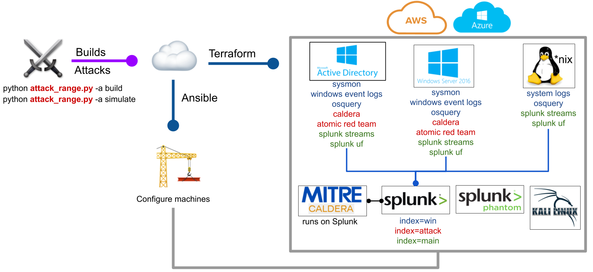

## Purpose 🛡
The Attack Range is a detection development platform, which solves three main challenges in detection engineering. First, the user is able to build quickly a small lab infrastructure as close as possible to a production environment. Second, the Attack Range performs attack simulation using different engines such as Atomic Red Team or Caldera in order to generate real attack data. Third, it integrates seamlessly into any Continuous Integration / Continuous Delivery (CI/CD) pipeline to automate the detection rule testing process.  

## Building 👷‍♂️

Attack Range can be built in three different ways:

- **cloud** using terraform and AWS or Azure.
- **locally** with vagrant and virtualbox see the [attack\_range\_local](https://github.com/splunk/attack_range_local/) project for details
- **serverless** see the [attack\_range\_cloud](https://github.com/splunk/attack_range_cloud/) project for details

## Installation 🏗

### [AWS and Ubuntu 18.04](https://github.com/splunk/attack_range/wiki/AWS:-Ubuntu-18.04-Installation)

### [AWS and MacOS](https://github.com/splunk/attack_range/wiki/AWS:-MacOS-Installation)

### [Azure and MacOS](https://github.com/splunk/attack_range/wiki/Azure:-MacOS-Installation)

### Installation Notes For AWS
- attack-range/init.sh installs all the requirements, initializes terraform and downloads a fresh clone of the most recent attack-range repo if we need to start from scratch. Explore the commands in init.sh to see the initial setup and installation processes. 
- Attack range CLI changes quite a bit as new features are added to the repo so we need to be careful about that before adding GUI elements that make CLI calls

### AWS Set up 
- We have to manually set up a programmatic AWS user and ssh authentication. Refer to this article for step by step pictures. 
(https://github.com/splunk/attack_range/wiki/AWS:-Ubuntu-18.04-Installation). The following notes include tricky things not in the article. 
## Create an RSA key
- On the terminal
 > ssh-keygen 
This command asks for a "keyName" and a "passphrase". "passphrase" sould be empty. This command generates two files **keyName.pub and keyName**. These files the public and private keys respectively necessary for authentication. Save these files in an appropriate location. We need both these files for this set up. Its important that we don't push these files, particularly the key to any repo.  

## Import the keyName.pub we just created to AWS. 
- Open the EC2 dashboard.  On the menu on the left: Network and Security >> Key Pairs 
- In the Key Pairs Menu under "Action" Import New Key and select the **.pub** file just created. Also give it an appropriate name and make note of this name we will need it later. The **keyname** that you give here is needed to configure attack range.
View this article to see this in more detail.   

## Create a programmatic user. 

- The details for creating a programmatic user are also in the article mentioned above. The jist of it is that we have to create a new user in the IAM section of AWS. The set up process is pretty stright forward. 
On the final step of the adding the user we will see a screen with the credentials for the user. The credentials are named **ACCESS-KEY-ID and SECURE-KEY-ID** 
We need to note this, or copy them somewhere for easy access later.


## Linking our Attack-Range project with the created user. 
On the terminal 
> aws configure
This command will ask for the ACCESS-KEY-ID, SECURE-KEY-ID. Use the credentials saved earlier. 

## Attack Range Configuration File

**attackrange\attack_range.conf** is the most important file in the project for our purposes. This is how we configure the full range of vms that are spun by attack range. 

Have the following things in hand before changing the configuration file. 
1. file path of the private key **filepath/keyName** when we created the RSA key
2. The **keyName** of the key we created in AWS

# Find the section titled \[Global\] and change 

attack_range_password = yourpassword  #this is the password that will be assigned to all instances that are spun up by attack range, if not specified elsewhere. 

# Find the section titled \[range_settings\] in the configuration file and make the following changes

key_name = **keyName** #this is the name of our key in AWS
private_key_path = **filepath/keyName** #this is the filepath to the private key we saved on the system.


This completes the minimal setup needed to spin up a splunk server and a windows domain controller to simulate attacks on the domain controller.
Need to explore the options a little more to see the full potential of this software. 

## build the configured infrastructure.
> python attack-range.py build 


## Architecture 🏯


The virtualized deployment of Attack Range can be configured to:

- Windows Domain Controller
- Windows Server
- Windows Workstation
- A Kali Machine
- Splunk Server (Data Aggregator)
- Phantom Server
- Zeek Sensor (Packet Sniffer)

#### Logging
The following log sources are collected from the machines:

- Windows Event Logs (```index = win```)
- Sysmon Logs (```index = win```)
- Powershell Logs (```index = win```)
- Network Logs with Splunk Stream (```index = main```)
- Attack Simulation Logs from Atomic Red Team and Caldera (```index = attack```)

## Running 🏃‍♀️
Attack Range supports different actions:

- Configuring Attack Range
- Build Attack Range
- Perform Attack Simulation
- Test with Attack Range
- Destroy Attack Range
- Stop Attack Range
- Resume Attack Range
- Dump Log Data from Attack Range


### Build Attack Range
- Build Attack Range
```
python attack_range.py build
```

### Show Attack Range Infrastructure
- Show Attack Range Infrastructure
```
python attack_range.py show
```

### Perform Attack Simulation
- Perform Attack Simulation
```
python attack_range.py simulate -st T1003.001 -t ar-win-dc-default-Attack-Range-Key
```

### Test with Attack Range
- Automated testing of detection:
```
python attack_range.py test -tf tests/T1003_001.yml
```

### Destroy Attack Range
- Destroy Attack Range
```
python attack_range.py destroy
```

### Stop Attack Range
- Stop Attack Range
```
python attack_range.py stop
```

### Resume Attack Range
- Resume Attack Range
```
python attack_range.py resume
```

### Dump Log Data from Attack Range
- Dump Log Data from Attack Range
```
python attack_range.py dump -dn data_dump
```


### Replay Dumps into Attack Range Splunk Server
- Replay previously saved dumps from Attack Range
```
python attack_range.py replay -dn data_dump [--dump NAME_OF_DUMP]
```
- default will dump all enabled dumps described in `attack_data/dumps.yml`
- with optional argument `--dump` you can specify which dump to replay
```
python attack_range.py replay -dn data_dump --dump windows_sec_events
```

## Features 💍
- [Splunk Server](https://github.com/splunk/attack_range/wiki/Splunk-Server)
  * Indexing of Microsoft Event Logs, PowerShell Logs, Sysmon Logs, DNS Logs, ...
  * Preconfigured with multiple TAs for field extractions
  * Out of the box Splunk detections with Enterprise Security Content Update ([ESCU](https://splunkbase.splunk.com/app/3449/)) App
  * Preinstalled Machine Learning Toolkit ([MLTK](https://splunkbase.splunk.com/app/2890/))
  * Splunk UI available through port 8000 with user admin
  * ssh connection over configured ssh key

- [Splunk Enterprise Security](https://splunkbase.splunk.com/app/263/)
  * [Splunk Enterprise Security](https://splunkbase.splunk.com/app/263/) is a premium security solution requiring a paid license.
  * Enable or disable [Splunk Enterprise Security](https://splunkbase.splunk.com/app/263/) in [attack_range.conf](https://github.com/splunk/attack_range/blob/develop/attack_range.conf.template)
  * Purchase a license, download it and store it in the apps folder to use it.

- [Splunk Phantom](https://www.splunk.com/en_us/software/splunk-security-orchestration-and-automation.html)
  * [Splunk Phantom](https://www.splunk.com/en_us/software/splunk-security-orchestration-and-automation.html) is a Security Orchestration and Automation platform
  * For a free development license (100 actions per day) register [here](https://my.phantom.us/login/?next=/)
  * Enable or disable [Splunk Phantom](https://www.splunk.com/en_us/software/splunk-security-orchestration-and-automation.html) in [attack_range.conf](https://github.com/splunk/attack_range/blob/develop/attack_range.conf.template)

- [Windows Domain Controller & Window Server & Windows 10 Client](https://github.com/splunk/attack_range/wiki/Windows-Infrastructure)
  * Can be enabled, disabled and configured over [attack_range.conf](https://github.com/splunk/attack_range/blob/develop/attack_range.conf.template)
  * Collecting of Microsoft Event Logs, PowerShell Logs, Sysmon Logs, DNS Logs, ...
  * Sysmon log collection with customizable Sysmon configuration
  * RDP connection over port 3389 with user Administrator

- [Atomic Red Team](https://github.com/redcanaryco/atomic-red-team)
  * Attack Simulation with [Atomic Red Team](https://github.com/redcanaryco/atomic-red-team)
  * Will be automatically installed on target during first execution of simulate
  * Atomic Red Team already uses the new Mitre sub-techniques

- [Caldera](https://github.com/mitre/caldera)
  * Adversary Emulation with [Caldera](https://github.com/mitre/caldera)
  * Installed on the Splunk Server and available over port 8888 with user admin
  * Preinstalled Caldera agents on windows machines

- [Kali Linux](https://www.kali.org/)
  * Preconfigured Kali Linux machine for penetration testing
  * ssh connection over configured ssh key

